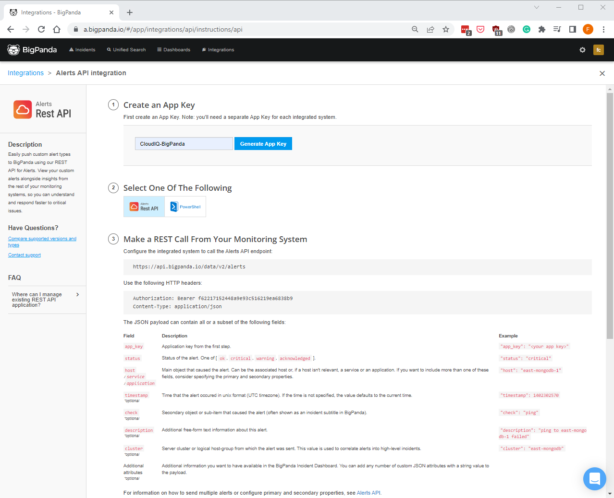
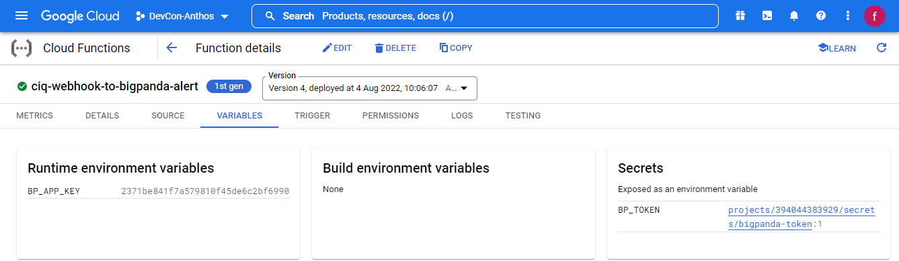
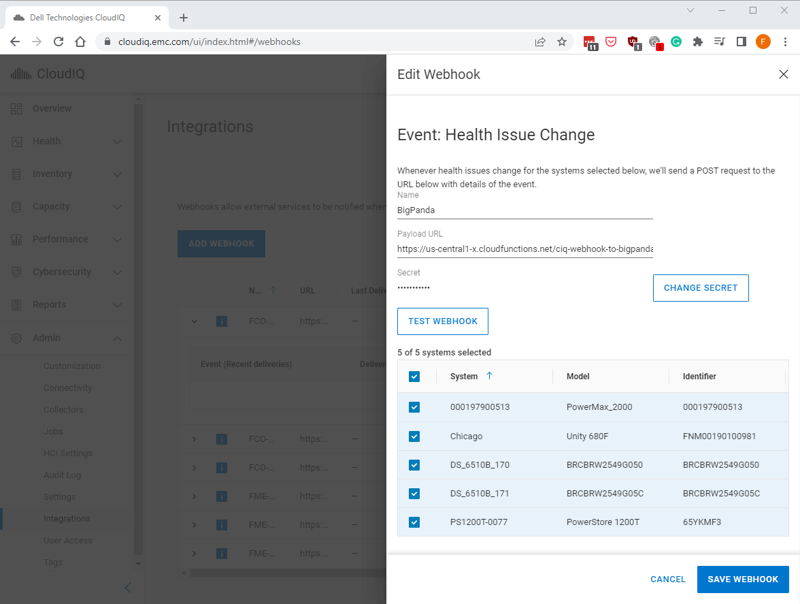
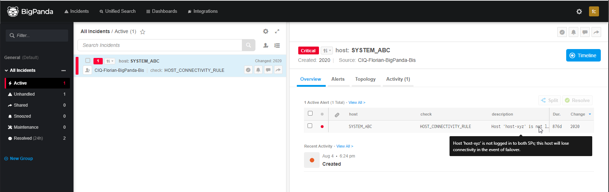

# clouqiq-webhook-to-bigpanda-alert

# Intro
This third article of the CloudIQ Webhooks series will discuss how to integrate health events to https://www.bigpanda.io/.

BigPanda offers a solution that has a modern twist on [event management process](https://en.wikipedia.org/wiki/Event_management_(ITIL)). The main product consists of a fully customizable Cloud Hosted event management console for event integration, reporting, correlation, enrichment, etc.

# Integration
On the CloudIQ side, we can enable webhook integration. Webhook integration offers minimal configuration options aside from the destination and the secret to sign the payload.

On the BigPanda side, we have a couple of possibilities for 3rd-party integration. [BigPanda’s Open Integration Hub](https://www.bigpanda.io/our-product/open-integration-hub/) allows to implement mapping of elements from a graphical interface ; or the raw [REST API](https://docs.bigpanda.io/reference/introduction).

In our case, we will use the REST API. Indeed some of the requirements of the Open Integration Hub (alert severity, configurable application key, etc.) are not configurable in CloudIQ Webhook.

## Architecture
The main challenge to integrating CloudIQ health events to Big Panda alerts is implementing a mapping function to translate CloudIQ fields into BigPanda fields.

To do so, we will once again use a serverless function to :
- receive the health event from CloudIQ Webhook trigger
- convert CloudIQ health event into a BigPanda alert
- post that alert to BigPanda

In that integration, the serverless function will be a Google Cloud Function. Any other serverless framework can work.


## Create BigPanda REST Application
The first step is to create an application for integration in BigPanda ; to do so the sequence is to :
1. login
2. click on the `🔌Integration` button on the top of the console
3. click on the blue button `➕New Integration`
4. select `Alerts Rest API` (first card)
5. set an integration name & click on the blue button `Generate App Key`
6. save the generated Bearer token and App Key

In case you forgot to save the **token** and **application key**, you can obtain them later by clicking on `Review Instructions`.

Note that the **token** and **application key** will be needed later to configure the trigger to post data to that endpoint.


## Create the GCP Cloud Function
That step is very similar to what has been presented in the CloudIQ to Slack tutorial. The only changes are that we are using a [golang runtime](https://cloud.google.com/functions/docs/concepts/go-runtime) and we store the authentication token in a [secret](https://cloud.google.com/functions/docs/configuring/secrets) instead of a plain text [environment variable](https://cloud.google.com/functions/docs/configuring/env-var).



### Implement the mapping
Using Go's static typing first approach, we have clearly defined `struct` for the input (`CiqHealthEvent`) and output (`BigPandaAlerts`).

Most of the logic consists of mapping one field to the other.
```go
func CiqEventMapping(c *CiqHealthEvent, bp *BigPandaClient) *BigPandaAlerts {
	log.Println("mapping input CloudIQ event: ")
	log.Printf("%+v", c)
	alert := BigPandaAlerts{
		AppKey:  bp.AppKey,
		Cluster: "CloudIQ",
		Host:    c.SystemName,
	}
	if len(c.NewIssues) > 0 {
		for _, v := range c.NewIssues {
			alert.Alerts = append(alert.Alerts, BigPandaAlert{
				Status:             statusForScore(c.CurrentScore),
				Timestamp:          c.Timestamp,
				Host:               c.SystemName,
				Description:        v.Description,
				Check:              v.RuleID,
				IncidentIdentifier: v.ID,
			})
		}
	}
	return &alert
}
```

A few things to notice are:
1. CloudIQ doesn't have the notion of severity; therefore, we convert the score in status using the code below
2. CloudIQ has an event identifier that will help to deduplicate the alert in BigPanda or reopen a closed event in case of a re-notify

```go
// BigPanda status values: ok,ok-suspect,warning,warning-suspect,critical,critical-suspect,unknown,acknowledged,oksuspect,warningsuspect,criticalsuspect,ok_suspect,warning_suspect,critical_suspect,ok suspect,warning suspect,critical suspect
func statusForScore(s int) string {
	if s == 100 {
		return "ok"
	} else if s <= 99 && s > 75 {
		return "ok suspect"
	} else if s <= 75 && s > 70 {
		return "warning"
	} else if s <= 70 {
		return "critical"
	} else {
		return "unknown"
	}
}
```

### Build
Behind the scene, the GCP Cloud Functions are built and executed as a container. To develop and test the code locally (instead of doing everything in GCP Console), we can develop locally and then build the package using [buildpack](https://github.com/googlecloudplatform/buildpacks) like GCP does :
```shell
pack build \
     --builder gcr.io/buildpacks/builder:v1 \
     --env GOOGLE_RUNTIME=go \
     --env GOOGLE_FUNCTION_SIGNATURE_TYPE=http \
     --env GOOGLE_FUNCTION_TARGET=CiqEventToBigPandaAlert \
     ciq-webhook-to-bigpanda-alert
```

### Run
After the build is successful, we can test it with something similar to
```shell
docker run --rm -p 8080:8080 -e BP_TOKEN=xxxxx -e BP_APP_KEY=yyyyy ciq-webhook-to-bigpanda-alert
```

Alternatively, you can create a `main.go` and just run it with `FUNCTION_TARGET=CiqEventToBigPandaAlert go run cmd/main.go`

### Deploy
Once the function is ready, you can publish it with :
```shell
cloud functions deploy ciq-webhook-to-bigpanda-alert --runtime go116 --entry-point CiqEventToBigPandaAlert --trigger-http --allow-unauthenticated
```

## Configure CloudIQ
Last but not least it is time to point the CloudIQ webhook to the GCP Function trigger URL


### Test
To ease the simulation of a webhook event, you can go to the CloudIQ Integration and click on `TEST WEBHOOK` button.

For an actual event and not just a `ping`, you can use the [`easy_curl.sh` script](https://developer.dell.com/apis/4138/versions/1.0/docs/Tutorials/02-webhook-integration-svcnow-slack.md#easy-post-script-1). Same thing for a local try without CloudIQ.

# Conclusion
And if everything flows correctly, you must see the health alerts popping in BigPanda console :



# References
https://docs.bigpanda.io/reference/alerts

https://cloud.google.com/functions/docs/concepts/go-runtime

https://developer.dell.com/apis/4138/versions/1.0/docs/Tutorials/02-webhook-integration-svcnow-slack.md